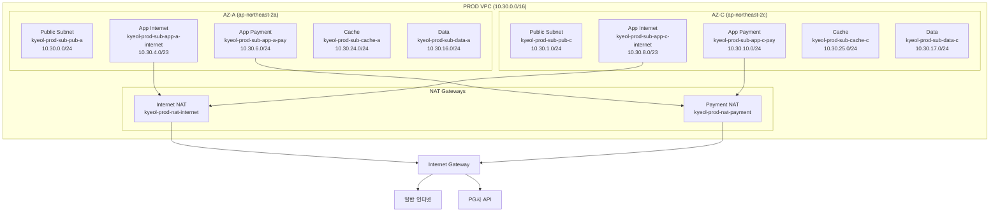

# PROD 환경 서비스별 NAT 분리 아키텍처

## 개요

PROD 환경에서 **결제(PG) 트래픽**과 **일반 인터넷 트래픽**을 완전히 분리하여 운영합니다.

### 목적
1. **보안 강화**: 결제 트래픽을 별도 경로로 격리
2. **PG사 화이트리스트**: 결제 NAT의 고정 EIP를 PG사에 등록
3. **장애 격리**: 일반 NAT 장애 시 결제 서비스 영향 없음

---

## 아키텍처 구조



---

## 서브넷 구성

### 전체 서브넷 (총 10개)

| 유형 | 이름 | CIDR | AZ | 용도 |
|------|------|------|-----|------|
| Public | `kyeol-prod-sub-pub-a` | 10.30.0.0/24 | a | ALB, NAT 배치 |
| Public | `kyeol-prod-sub-pub-c` | 10.30.1.0/24 | c | ALB, NAT 배치 |
| App Internet | `kyeol-prod-sub-app-a-internet` | 10.30.4.0/23 | a | 일반 서비스 |
| App Internet | `kyeol-prod-sub-app-c-internet` | 10.30.8.0/23 | c | 일반 서비스 |
| App Payment | `kyeol-prod-sub-app-a-pay` | 10.30.6.0/24 | a | 결제 전용 |
| App Payment | `kyeol-prod-sub-app-c-pay` | 10.30.10.0/24 | c | 결제 전용 |
| Cache | `kyeol-prod-sub-cache-a` | 10.30.24.0/24 | a | ElastiCache |
| Cache | `kyeol-prod-sub-cache-c` | 10.30.25.0/24 | c | ElastiCache |
| Data | `kyeol-prod-sub-data-a` | 10.30.16.0/24 | a | RDS |
| Data | `kyeol-prod-sub-data-c` | 10.30.17.0/24 | c | RDS |

---

## NAT Gateway 구성

| NAT | 이름 | EIP | 배치 AZ | 용도 |
|-----|------|-----|---------|------|
| Internet NAT | `kyeol-prod-nat-internet` | `kyeol-prod-eip-internet` | AZ-A | 일반 서비스 egress |
| Payment NAT | `kyeol-prod-nat-payment` | `kyeol-prod-eip-payment` | AZ-C | 결제 API egress |

> **PG사 화이트리스트**: `kyeol-prod-eip-payment`의 Public IP를 PG사에 등록

---

## Route Table 매핑

| Route Table | 대상 NAT | 연결 서브넷 |
|-------------|---------|------------|
| `kyeol-prod-rt-pub` | IGW | Public 서브넷 |
| `kyeol-prod-rt-app-internet` | Internet NAT | App Internet, Cache, Data |
| `kyeol-prod-rt-app-payment` | Payment NAT | App Payment |

---

## EKS NodeGroup 분리

| NodeGroup | 이름 | 서브넷 | NAT 경로 | Taint |
|-----------|------|--------|---------|-------|
| General | `kyeol-prod-ng-general` | App Internet (a, c) | Internet NAT | - |
| Payment | `kyeol-prod-ng-payment` | App Payment (a, c) | Payment NAT | `payment=true:NoSchedule` |

### 결제 Pod 배포 예시

```yaml
apiVersion: v1
kind: Pod
metadata:
  name: payment-service
spec:
  tolerations:
    - key: "payment"
      operator: "Equal"
      value: "true"
      effect: "NoSchedule"
  nodeSelector:
    node-type: payment
  containers:
    - name: payment-api
      image: kyeol-prod-api/payment:latest
```

---

## 활성화 방법

`terraform.tfvars`에서 설정:

```hcl
enable_payment_nat = true
```

---

## 검증 명령어

```powershell
# 1. NAT Gateway 확인
aws ec2 describe-nat-gateways --filter "Name=tag:Project,Values=kyeol" `
  --query "NatGateways[].{Name:Tags[?Key=='Name'].Value|[0],EIP:NatGatewayAddresses[0].PublicIp}"

# 2. Payment NAT EIP 확인 (PG사 등록용)
terraform output -raw payment_nat_public_ip

# 3. NodeGroup 서브넷 확인
aws eks describe-nodegroup --cluster-name kyeol-prod-eks --nodegroup-name kyeol-prod-ng-payment `
  --query "nodegroup.subnets"
```

---

## 비용 정보

| 리소스 | 월 예상 비용 |
|--------|------------|
| Internet NAT Gateway | $32 + 데이터 처리 |
| Payment NAT Gateway | $32 + 데이터 처리 |
| **합계** | **~$64/월** |

---

## 문서 정보

- **작성일**: 2026-01-12
- **작성자**: kyeol-project 팀
- **관련 코드**: `kyeol-infra-terraform/envs/prod/main.tf`
